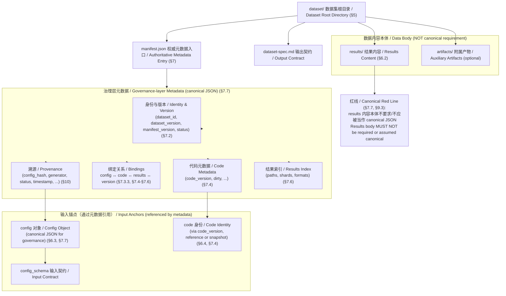
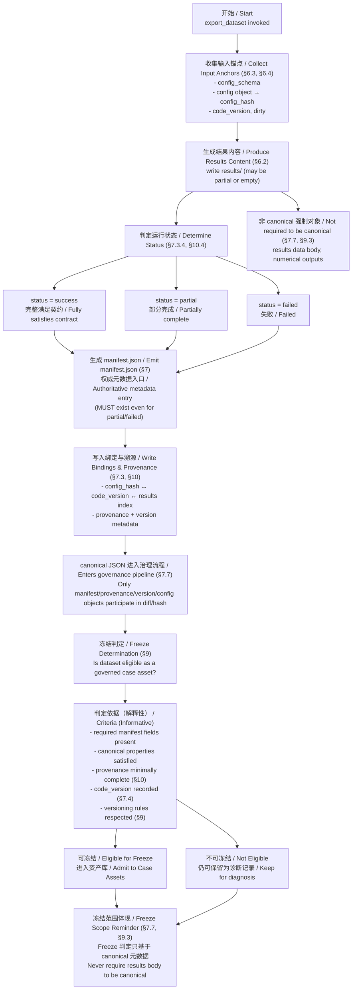

# Dataset Specification

**export_dataset 的权威输出结构与元数据入口规范 | Authoritative Output Structure and Manifest Specification for `export_dataset`**

> 本文档定义 `export_dataset` 所生成 数据集 的**权威输出结构与 manifest（权威元数据入口）规范**。
> 一旦冻结，任何结构性变更均视为**破坏性版本变更**。

> This document defines the **authoritative output structure and manifest specification** for datasets generated by `export_dataset`.
> Once frozen, any structural modification shall be considered a **breaking change**.

---

## 1. 目的与适用范围 | Purpose and Scope

本规范用于：

- 定义 `export_dataset` 的**唯一合法输出结构**
- 明确 数据集 在**脱离运行环境**时，仍可被**独立理解、验证与复现**
- 作为下游消费方（分析、复现、审计、归档）的**稳定接口契约**

本规范适用于所有通过 `export_dataset` 生成的 数据集，不依赖具体模型、任务或运行平台。

This specification is intended to:

- Define the **only valid output structure** of `export_dataset`
- Ensure that a dataset can be **independently understood, verified, and reproduced** even when detached from its runtime environment
- Serve as a **stable interface contract** for downstream consumers (analysis, reproducibility, auditing, archival)

This specification applies to all datasets generated via `export_dataset`, independent of specific models, tasks, or runtime platforms.

---

## 2. 规范地位与契约效力（冻结）| Normative Status and Contractual Authority (Frozen)

### 2.1 规范地位 | Normative Status

本规范为 `export_dataset` 输出数据集的**权威契约规范（Authoritative Output Contract Specification）**。
This specification is the **Authoritative Output Contract Specification** for datasets generated by export_dataset.

凡由 `export_dataset` 生成并声称符合本规范的数据集，均视为自愿接受本规范的全部约束。
Any dataset generated by `export_dataset` and claiming compliance with this specification SHALL be deemed to have voluntarily accepted all constraints defined herein.

本规范不是设计说明文档，不是实现建议文档，也不是操作指南，而是：

> 数据集结构、溯源、验证与冻结行为的正式契约约束。

This specification is not a design document, not an implementation guideline, and not an operational manual. Rather, it constitutes:

> A formal contractual constraint governing dataset structure, provenance, validation, and freeze behavior.

---

### 2.2 优先级与冲突裁决 | Priority and Conflict Resolution

当本规范与以下内容存在冲突时：

- README 文件
- 代码注释
- 运行文档
- 外部说明文档
- 非规范性附录

应以本规范为最终裁决依据。

In the event of conflict between this specification and any of the following:

- README files
- Code comments
- Runtime documentation
- External explanatory documents
- Informative appendices

This specification SHALL prevail as the final authority.

任何未在本规范中显式定义的语义，不得通过隐式约定、实现细节或历史行为推断获得治理效力。
Any semantic meaning not explicitly defined in this specification SHALL NOT obtain governance validity through implicit conventions, implementation details, or historical behavior.

---

### 2.3 契约约束范围 | Scope of Contractual Constraints

本规范的契约效力覆盖：

1. `manifest.json` 的结构与字段语义
2. 溯源信息的完整性与最小集合
3. 合规验证与自动化校验要求
4. 冻结规则与版本红线
5. 冻结级数据集的可审计性与可追溯性

The contractual authority of this specification covers:

1. The structure and field semantics of `manifest.json`
2. The completeness and minimum set of provenance information
3. Compliance validation and automated verification requirements
4. Freeze rules and version red lines
5. Auditability and traceability of freeze-level datasets

本规范不约束：

- 运行性能
- 算法选择
- 数值结果本身
- 研究结论正确性

但其约束结果的结构表达与治理属性。

This specification does not govern:

- Runtime performance
- Algorithm selection
- Numerical results themselves
- Correctness of research conclusions

However, it governs the structural representation and governance attributes of such results.

---

### 2.4 违反与后果 | Violations and Consequences

违反本规范任一强制性条款，应视为**治理违规行为**。
Violation of any mandatory clause in this specification SHALL be considered a **governance violation**.

治理违规包括但不限于：

- 结构违规
- 溯源违规
- 验证失败
- 版本冲突
- 隐式行为绕过

Governance violations include, but are not limited to:

- Structural violations
- Provenance violations
- Validation failures
- Version conflicts
- Circumvention through implicit behavior

对于治理违规的数据集：

1. 不得进入资产库；
2. 不得参与冻结判定；
3. 必须修复后重新发布；
4. 必要时必须提升主版本号。

For datasets identified as governance-violating:

1. They SHALL NOT enter the asset repository;
2. They SHALL NOT participate in freeze determination;
3. They MUST be corrected and republished;
4. A Major version increment SHALL be required when necessary.

---

### 2.5 隐式行为禁止原则 | Prohibition of Implicit Circumvention

不得通过以下方式规避本规范：

- 通过缺省值绕过字段声明
- 通过隐藏字段绕过溯源要求
- 通过删除信息掩盖失败状态
- 通过文件系统行为表达语义
- 通过实现细节改变规范语义

This specification SHALL NOT be circumvented by means including, but not limited to:

- Using default values to bypass required field declarations
- Hiding fields to evade provenance requirements
- Removing information to conceal failure status
- Expressing semantics through file system behavior
- Altering normative meaning through implementation details

所有影响结构、溯源、版本或冻结语义的行为，必须显式表达。
Any behavior affecting structural, provenance, version, or freeze semantics MUST be explicitly declared.

---

### 2.6 长期冻结定位 | Long-Term Freeze Positioning

本规范定位为：

> 长期稳定的资产级数据集治理规范。

其结构与语义应保持稳定性。

This specification is positioned as:

> A long-term, stable, asset-level dataset governance specification.

Its structure and semantics SHALL remain stable.

任何破坏性修改：

- 必须提升 `dataset_version` 主版本号；
- 必须在变更记录中明确说明；
- 不得通过非显式方式变更语义。

Any destructive modification:

- MUST increment the Major version of `dataset_version`;
- MUST be explicitly documented in change records;
- MUST NOT alter semantics through non-explicit means.

---

### 2.7 与其他章节的关系 | Relationship with Other Sections

- §7 定义结构与 schema
- §8 定义合规验证闭环
- §9 定义冻结与版本红线
- §10 定义溯源治理要求

本节定义上述章节的契约效力与优先级。

- §7 defines structure and schema
- §8 defines the compliance validation loop
- §9 defines freeze and version red-line rules
- §10 defines provenance governance requirements

This section establishes the contractual authority and priority of the above sections.

---

## 3. 术语与定义（冻结）| Terms and Definitions (Frozen)

## 3.1 术语适用范围 | Scope of Terminology

本节定义本规范中使用的核心术语。
This section defines the core terms used in this specification.

除非另有说明，以下术语在全文中具有唯一且固定的语义，不得在不同章节中改变其含义。
Unless otherwise stated, the following terms have unique and fixed meanings throughout this document and SHALL NOT change across different sections.

未在本节定义的术语，不得被赋予规范性约束语义。
Terms not defined in this section SHALL NOT be assigned normative governance meaning.

---

## 3.2 数据集 | Dataset

指由 `export_dataset` 生成并包含：

- 目录结构
- `manifest.json`
- 版本标识文件
- 结果文件

所构成的完整资产单元。

Refers to the complete asset unit generated by `export_dataset`, consisting of:

- directory structure
- `manifest.json`
- version identification files
- result files

数据集是本规范的治理对象。
A dataset is the governance object of this specification.

---

## 3.3 Manifest

指数据集根目录中的 `manifest.json` 文件。
Refers to the `manifest.json` file located at the root directory of a dataset.

其作用是：

- 提供结构化元数据
- 声明溯源信息
- 声明版本标识
- 支持验证与冻结判定

Its purposes include:

- providing structured metadata
- declaring provenance information
- declaring version identification
- supporting validation and freeze determination

Manifest 是数据集的唯一权威元数据入口。
The Manifest is the sole authoritative metadata entry of a dataset.

---

## 3.4 冻结 | Freeze

指数据集被判定为：

- 结构合法
- 溯源完整
- 版本一致
- 无治理冲突

并被允许作为稳定资产引用的状态。

Refers to the state in which a dataset is determined to be:

- structurally valid
- provenance-complete
- version-consistent
- free of governance conflicts

and is permitted to be referenced as a stable asset.

冻结是一种治理状态，而非文件系统操作。
Freeze is a governance state, not a file system operation.

---

## 3.5 冻结级数据集 | Freeze-Level Dataset

指满足：

- §7 结构要求
- §8 验证要求
- §9 冻结规则
- §10 溯源要求

的完整数据集。

Refers to a complete dataset that satisfies:

- §7 structural requirements
- §8 validation requirements
- §9 freeze rules
- §10 provenance requirements

冻结级数据集具有可引用与可审计资格。
A freeze-level dataset possesses eligibility for reference and audit.

---

## 3.6 合规 | Compliant

指数据集满足本规范所有强制性条款。
Refers to a dataset that satisfies all mandatory clauses of this specification.

合规是冻结的必要条件，但不等同于冻结。
Compliance is a necessary condition for freeze, but is not equivalent to freeze.

---

## 3.7 治理违规 | Governance Violation

指违反本规范任一强制性条款的行为。
Refers to any action that violates a mandatory clause of this specification.

治理违规包括但不限于：

- 结构违规
- 溯源违规
- 验证失败
- 版本冲突
- 隐式语义绕过

Governance violations include, but are not limited to:

- structural violations
- provenance violations
- validation failures
- version conflicts
- circumvention via implicit semantics

治理违规的数据集不得被冻结。
Datasets with governance violations SHALL NOT be frozen.

---

## 3.8 规范性 | Normative

指具有强制约束力的条款。
Refers to clauses that carry mandatory binding force.

包含但不限于：

- 必须
- 不得
- SHALL
- MUST

Including, but not limited to:

- MUST
- MUST NOT
- SHALL
- SHALL NOT

规范性条款违反即构成治理违规。
Violation of a normative clause constitutes a governance violation.

---

## 3.9 非规范性 | Informative

指用于解释、说明或举例的内容。
Refers to content intended for explanation, clarification, or examples.

非规范性内容不具有强制约束力，不得覆盖规范性条款。
Informative content does not carry mandatory binding force and SHALL NOT override normative clauses.

---

## 3.10 破坏性修改 | Destructive Change

指会导致：

- 结构不兼容
- 版本语义改变
- 冻结语义失效
- 下游依赖失效

的修改行为。

Refers to a modification that results in:

- structural incompatibility
- semantic version change
- invalidation of freeze semantics
- downstream dependency failure

破坏性修改必须提升主版本号。
A destructive change MUST increment the Major version.

---

## 3.11 主版本号 | Major Version

指 `dataset_version` 中表示结构或语义级别变化的版本位。
Refers to the version component within `dataset_version` that represents structural or semantic-level changes.

主版本号提升表示：

- 破坏性修改
- 不兼容变更
- 冻结语义变更

Incrementing the Major version indicates:

- a destructive change
- incompatible modification
- change in freeze semantics

---

## 3.12 Canonical 表示 | Canonical Representation

指在本规范中用于计算一致性与哈希的唯一确定性表示形式。
Refers to the unique deterministic representation used within this specification for consistency checks and hash computation.

Canonical 表示必须：

- 顺序确定
- 无隐式信息
- 可重复生成

其具体实现规则由相关章节定义。

A canonical representation MUST:

- have deterministic ordering
- contain no implicit information
- be reproducible

Its specific implementation rules are defined in relevant sections.

---

## 3.13 绑定 | Binding

指数据集显式声明其：

- 配置来源
- 代码来源
- 版本标识

之间的确定性关联关系。

Refers to the deterministic association explicitly declared by a dataset among:

- configuration sources
- code sources
- version identifiers

绑定必须是结构化、可验证的。
Bindings MUST be structured and verifiable.

---

## 3.14 隐式语义 | Implicit Semantics

指未在 manifest 或规范条款中显式声明，但依赖：

- 文件系统结构
- 默认值
- 代码实现
- 历史行为

推断出的语义。

Refers to semantics inferred without explicit declaration in the manifest or normative clauses, but instead derived from:

- file system structure
- default values
- code implementation
- historical behavior

本规范禁止依赖隐式语义表达治理含义。
This specification prohibits the use of implicit semantics to express governance meaning.

---

## 3.15 资产级 | Asset-Level

指数据集被视为：

- 可审计
- 可追溯
- 可长期引用
- 可作为下游依赖

的治理级别。

Refers to the governance level at which a dataset is considered:

- auditable
- traceable
- long-term referenceable
- eligible as a downstream dependency

资产级不等同于研究完成度，而是治理成熟度。
Asset-level does not equate to research completeness, but to governance maturity.

---

## 3.16 长期冻结规范 | Long-Term Frozen Specification

指本规范定位为：

- 长期稳定
- 语义不可漂移
- 版本变更受控
- 结构不可隐式改变

的治理规范。

Refers to the positioning of this specification as:

- long-term stable
- semantically non-drifting
- version-controlled
- structurally non-implicitly alterable

A governance specification of long-term stability.

---

## 4. 设计原则 | Design Principles

1. **权威性 | Authoritative**
   数据集 本身即为最终事实来源，而非某次运行日志的副产物。

   The dataset itself is the final source of truth, not a byproduct of a specific runtime log.

2. **自解释性 | Self-describing**
   在不运行任何代码、不访问原始仓库的情况下，数据集 的内容、来源与语义应可被理解。

   The dataset’s content, origin, and semantics must be understandable without executing any code or accessing the original repository.

3. **可追溯性 | Provenance-aware**
   所有结果必须能追溯到：
   - 使用的配置
   - 使用的代码版本
   - 生成时的系统与工具版本

   All results must be traceable to:
   - The configuration used
   - The code version used
   - The system and tool versions at generation time

4. **结构冻结 | Frozen Structure**
   数据集 的目录结构与 manifest schema 一经冻结，不得进行隐式或兼容性破坏的修改。

   Once frozen, the dataset directory structure and manifest schema MUST NOT be modified implicitly or in a compatibility-breaking manner.

5. **规范表示 | Canonical Representation**
   本规范继承《DESIGN_CONTRACT》中定义的规范表示（Canonical Representation）规则。数据集 的权威元数据入口文件为 `dataset/manifest.json`，其权威格式为 **JSON**；所有参与 **语义差异比较、哈希、溯源 绑定、版本判定与冻结治理**的 数据集 元数据，均以 canonical JSON 表示为准。

   This specification inherits the canonical representation rules defined in _DESIGN_CONTRACT_. The authoritative metadata entry file of a dataset is `dataset/manifest.json`, whose authoritative format is JSON. All dataset metadata involved in semantic diff comparison, hashing, provenance binding, version determination, and freeze governance MUST be represented as canonical JSON.

---

## 5. Dataset 顶层目录结构（冻结）| Dataset Top-level Directory Structure (Frozen)

`export_dataset` **必须**生成如下顶层结构：

```
dataset/
├── manifest.json
├── results/
├── config/
├── code/
├── version/
└── README.md   （可选，但强烈建议）
```

`export_dataset` **MUST** generate the following top-level structure:

```
dataset/
├── manifest.json
├── results/
├── config/
├── code/
├── version/
└── README.md   (optional, but strongly recommended)
```

### 5.1 顶层结构约束 | Top-level Structure Constraints

- 顶层目录名 **必须为** `dataset/`
- 不得在顶层新增未声明的目录
- 所有顶层目录的存在与语义由本规范定义，**不得复用或重载语义**

- 若需新增顶层目录，必须提升 `dataset_version` 的主版本号（Major），否则视为破坏性变更

- The top-level directory name **MUST be** `dataset/`
- No undeclared directories may be added at the top level
- The existence and semantics of all top-level directories are defined by this dataset specification and **MUST NOT be reused or overloaded**
- Any addition of a new top-level directory MUST increment the Major version of `dataset_version`; otherwise, it is considered a breaking change

---

## 6. 各目录语义说明 | Directory Semantics

### 6.1 `manifest.json`（必需 | Required）

`manifest.json` 是 数据集 的**权威入口与索引文件**，用于描述：

- 数据集 的身份
- 内容组成
- 溯源 关系
- 版本与冻结信息

详见第 5 章。

`manifest.json` is the **authoritative entry and index file** of the dataset, used to describe:

- Dataset identity
- Content composition
- Provenance relationships
- Versioning and freeze information

See Chapter 5 for details.

---

### 6.2 `results/`（必需 | Required）

#### 6.2.1 基本结构约束 | Basic Structural Constraints

必须用于存放 **export_dataset 的核心输出结果**。
MUST store the core output results of export_dataset.

约束：

- 内容为只读结果（不可包含生成脚本）
- 结果文件的具体格式由任务定义，但：
  - **文件路径与文件名必须稳定**
  - 所有结果文件 **必须在 manifest 中被引用**

Constraints:

- Contents MUST be read-only results (no generation scripts allowed)
- Result file formats are task-defined, but:
  - **File paths and file names MUST remain stable**
  - All result files **MUST be referenced in the manifest**

示例：

```
results/
├── predictions.jsonl
├── metrics.json
└── samples/
    └── sample_0001.json
```

Example:

```
results/
├── predictions.jsonl
├── metrics.json
└── samples/
    └── sample_0001.json
```

#### 6.2.2 样本组织规范 | Sample Organization

若 数据集 包含样本级数据，必须放置于`results/samples/` 目录：

```
results/
└── samples/
    ├── sample_0001.json
    ├── sample_0002.json
    └── index.json
```

约束：

- 样本文件 **必须可独立解析**
- `index.json`（如存在）仅作索引，不得承载权威语义

If the dataset contains sample-level data, such data MUST reside under the `results/samples/` directory:

```
results/
└── samples/
    ├── sample_0001.json
    ├── sample_0002.json
    └── index.json
```

Constraints:

- Sample files **MUST be independently parseable**
- `index.json` (if present) is for indexing only and MUST NOT carry authoritative semantics

---

### 6.3 `config/`（必需 | Required）

必须用于存放**生成 数据集 时使用的全部配置输入**。
MUST store all configuration inputs used to generate the dataset.

约束：

- 必须包含完整、原始、未裁剪的配置
- 配置文件内容必须与生成时完全一致
- 不得仅存 哈希 或摘要

Constraints:

- MUST include complete, original, untrimmed configurations
- Configuration files MUST exactly match those used at generation time
- Storing only hashes or summaries is NOT allowed

示例：

```
config/
├── run_config.yaml
├── model_config.yaml
└── dataset_config.yaml
```

Example:

```
config/
├── run_config.yaml
├── model_config.yaml
└── dataset_config.yaml
```

---

### 6.4 `code/`（必需 | Required）

必须用于存放**生成该 数据集 所依赖的代码快照或其可验证引用信息**。
MUST store either a code snapshot or verifiable code reference information used to generate the dataset.

允许两种形式之一（需在 manifest 中明确）：

1. **代码快照模式**

   ```
   code/
   └── snapshot/
       └── export_pipeline/
   ```

2. **代码引用模式**

   ```
   code/
   └── reference.json
   ```

One of the following two forms is allowed (must be declared in the manifest):

1. **Code Snapshot Mode**

```
code/
└── snapshot/
    └── export_pipeline/
```

2. **Code Reference Mode**

```
code/
└── reference.json
```

无论采用哪种方式，必须满足：

- 能唯一确定生成逻辑
- 能支持事后复现或审计

In either case, it MUST:

- Uniquely determine the generation logic
- Support post-hoc reproduction or auditing

---

### 6.5 `version/`（必需 | Required）

必须用于存放**版本与冻结相关的元信息**。
MUST store versioning and freeze-related metadata.

必须包含：

```
version/
├── dataset_version.txt
└── export_tool_version.txt
```

其中：

- `dataset_version.txt`
  数据集 结构与语义版本（用于破坏性变更判定）
- `export_tool_version.txt`
  执行 `export_dataset` 的工具版本

Must contain:

```
version/
├── dataset_version.txt
└── export_tool_version.txt
```

Where:

- `dataset_version.txt`
  Structural and semantic version of the dataset (used for breaking-change determination)
- `export_tool_version.txt`
  Tool version that executed `export_dataset`

---

## 7. `manifest.json` 规范（冻结）| Specification (Frozen)

### 7.1 规范地位与适用范围 | Normative Status and Scope of Application

`manifest.json` 是数据集的唯一权威元数据入口（Authoritative Metadata Entry），是数据集在治理层（Governance Layer）的唯一结构化表达对象。

`manifest.json` is the sole Authoritative Metadata Entry of the dataset and the only structured representation of the dataset at the Governance Layer.

本节定义：

- manifest 的唯一顶层结构
- 各顶层字段的语义
- 复杂对象（provenance / code / results）的内部结构
- 参与治理的 canonical JSON 最低要求

This section defines:

- The single authoritative top-level structure of the manifest
- The semantics of each top-level field
- The internal structures of complex objects (provenance / code / results)
- The minimum requirements for canonical JSON participating in governance

本节所定义的结构为**冻结结构（Frozen Structure）**。除非提升 `dataset_version` 主版本号，否则不得进行破坏性修改。

The structure defined in this section is a **Frozen Structure**. No breaking modification is permitted unless the Major version of `dataset_version` is incremented.

本节为 manifest 的唯一权威结构定义来源，其他章节不得重复定义其顶层结构。

This section is the sole authoritative source of the manifest structural definition. No other section may redefine its top-level structure.

---

### 7.2 Manifest 顶层结构（唯一权威结构）| Manifest Top-level Structure (Single Authoritative Structure)

`manifest.json` 必须为 JSON 对象，并且必须包含以下顶层字段：

`manifest.json` MUST be a JSON object and MUST contain the following top-level fields:

```
manifest
├── manifest_version        （string，必需（required））
├── dataset_id              （string，必需（required））
├── dataset_version         （string，必需（required））
├── status                  （string，必需（required））
├── provenance              （object，必需（required））
├── code                    （object，必需（required））
├── results                 （object，必需（required））
└── metadata                （object，可选（optional））
```

约束：

1. 除上述字段外，不得新增顶层字段。
2. 新增顶层字段属于破坏性结构变更，必须提升 `dataset_version` 主版本号。
3. 顶层字段名称不得重命名。
4. 顶层字段语义不得被重载或改变。

Constraints:

1. No additional top-level fields are permitted beyond those listed above.
2. Adding any top-level field constitutes a breaking structural change and MUST increment the Major version of `dataset_version`.
3. Top-level field names MUST NOT be renamed.
4. The semantics of top-level fields MUST NOT be redefined or overloaded.

---

### 7.3 顶层字段语义说明 | Top-level Field Semantics

#### 7.3.1 manifest_version

类型：string

表示 manifest schema 版本号。仅用于解析与前向兼容判断，不参与数据集语义版本判定。

Type: string

Indicates the version of the manifest schema. Used solely for parsing and forward compatibility determination. It does not participate in dataset semantic version determination.

---

#### 7.3.2 dataset_id

类型：string

数据集的唯一逻辑标识。应在同一资产空间内保持唯一。

Type: string

The unique logical identifier of the dataset. It SHOULD remain unique within the same asset space.

---

#### 7.3.3 dataset_version

类型：string

数据集的结构与语义版本标识。必须与 `version/dataset_version.txt` 文件内容逐字一致（包括大小写与格式）。

Type: string

The structural and semantic version identifier of the dataset. It MUST be exactly identical (character-by-character, including case and formatting) to the contents of `version/dataset_version.txt`.

---

#### 7.3.4 status

类型：string

允许值：

- success
- partial
- failed

表示数据集生成状态。`partial` 与 `failed` 不得被忽略或隐式推断。

Type: string

Allowed values:

- success
- partial
- failed

Indicates the generation status of the dataset. `partial` and `failed` MUST NOT be ignored or implicitly inferred.

该字段表示数据集生成状态，并且是唯一合法的状态字段。provenance 对象不得再定义 status 字段。
This field represents the dataset generation status and is the only valid status field. The provenance object MUST NOT define a separate `status` field.

---

#### 7.3.5 provenance

类型：object

用于表达数据集的溯源信息。其结构定义见 7.4。

Type: object

Used to represent the provenance information of the dataset. Its structure is defined in Section 7.4.

---

#### 7.3.6 code

类型：object

用于表达生成代码的标识信息。其结构定义见 7.5。

Type: object

Used to represent the identifying information of the code used to generate the dataset. Its structure is defined in Section 7.5.

---

#### 7.3.7 results

类型：object

用于表达结果文件的结构索引信息。其结构定义见 7.6。

Type: object

Used to represent the structural index information of result files. Its structure is defined in Section 7.6.

---

#### 7.3.8 metadata

类型：object（可选）

用于存放补充性信息。

约束：

- 不得影响版本判定
- 不得参与 canonical 表示
- 不得改变冻结语义

Type: object (optional)

Used to store supplemental information.

Constraints:

- MUST NOT affect version determination
- MUST NOT participate in canonical representation
- MUST NOT alter freeze semantics

---

### 7.4 Provenance 结构（唯一规范定义）| Provenance Structure (Single Normative Definition)

`provenance` 必须为对象，结构如下：

`provenance` MUST be an object with the following structure:

```
provenance
├── generator
│   ├── tool              （string，必需（required））
│   └── tool_version      （string，必需（required））
├── created_at            （string，必需（required），ISO 8601）
├── schema_version        （string，必需（required））
├── config_hash           （string，必需（required））
├── inputs                （object，必需（required））
│   ├── config_path       （string，必需（required））
│   └── code_ref          （string，必需（required））
└── 可选字段（optional fields）
```

约束：

1. `generator.tool` 必须为 `export_dataset`。
2. `generator.tool_version` 必须与 `version/export_tool_version.txt` 文件内容逐字一致。
3. `created_at` 必须使用 ISO 8601 格式。
4. `schema_version` 必须显式记录生成该数据集所使用配置契约（Configuration Schema）的版本。
5. `config_hash` 必须基于 `config/` 目录下全部配置文件的 canonical 表示计算。
6. 不得基于子集或派生表示计算 `config_hash`。
7. `inputs` 必须显式绑定配置与代码来源，不得依赖隐式约定。

本结构为唯一溯源结构定义，其他章节不得重复定义 provenance 顶层结构。

Constraints:

1. `generator.tool` MUST be `export_dataset`.
2. `generator.tool_version` MUST be exactly identical to the contents of `version/export_tool_version.txt`.
3. `created_at` MUST use ISO 8601 format.
4. `schema_version` MUST explicitly record the input-contract version of the configuration used to generate the dataset.
5. `config_hash` MUST be computed over the complete canonical representation of all configuration files under the `config/` directory.
6. `config_hash` MUST NOT be computed from subsets or derived representations.
7. `inputs` MUST explicitly bind configuration and code sources and MUST NOT rely on implicit conventions.

This structure is the only authoritative definition of provenance. No other section may redefine the top-level structure of provenance.

---

### 7.5 Code 结构 | Code Structure

`code` 必须为对象，结构如下：

`code` MUST be an object with the following structure:

```
code
├── code_version    （string，必需（required））
├── dirty           （boolean，必需（required））
├── repository      （string，可选（optional））
├── snapshot_path   （string，可选（optional））
└── code_hash       （string，可选（optional））
```

约束：

1. `code_version` 必须唯一标识生成代码的状态（例如 commit hash）。
2. `dirty` 字段不得省略，不得隐式推断。
3. 代码本体文件不参与 canonical JSON 要求。
4. 治理层只基于 `code` 元数据进行溯源与版本判断。

Constraints:

1. `code_version` MUST uniquely identify the state of the code used for generation (e.g., commit hash).
2. The `dirty` field MUST NOT be omitted and MUST NOT be implicitly inferred.
3. The code body itself does not participate in canonical JSON requirements.
4. Governance decisions are based solely on `code` metadata.

---

### 7.6 Results 索引结构 | Results Index Structure

`results` 必须为对象，结构如下：

`results` MUST be an object with the following structure:

```
results
├── path            （string，必需（required））
├── files           （array，必需（required））
├── compression     （string，可选（optional））
├── sharding        （object，可选（optional））
```

约束：

1. `files` 必须完整声明 `results/` 目录下的所有结果文件。
2. 不得存在未声明结果文件。
3. 若存在压缩，必须显式声明 `compression`。
4. 不允许隐式压缩。
5. 若存在分片，分片文件必须构成连续、无缺失编号序列。
6. 不得依赖文件系统排序表达语义。

`results` 对象只描述结构索引，不得包含结果数据本体。

Constraints:

1. `files` MUST fully declare all result files under the `results/` directory.
2. No undeclared result files are permitted.
3. If compression is used, `compression` MUST be explicitly declared.
4. Implicit compression is not permitted.
5. If sharding is used, shard files MUST form a continuous, gap-free numbered sequence.
6. File system ordering MUST NOT be relied upon to express semantics.

The `results` object describes structural indexing only and MUST NOT contain result data bodies.

---

#### 7.6.1 压缩策略 | Compression Strategy

- 允许对 `results/` 使用 `.gz` / `.zst`
- manifest **必须显式声明压缩格式**，即压缩格式必须成为结构化元数据，示例如下
- 不允许隐式压缩，即不得仅通过文件扩展名或默认约定进行推断

```
"results": {
  "compression": "gzip"
}
```

- `.gz` / `.zst` are allowed for `results/`
- The manifest **MUST explicitly declare the compression format**. That is, the compression format must become a structured metadata. For example, as follows
- Implicit compression is NOT allowed, meaning that no inference can be made merely based on file extensions or default conventions

```
"results": {
  "compression": "gzip"
}
```

---

#### 7.6.2 分片规则 | Sharding Rules

当结果规模较大时：

```
results/
├── shard_000.jsonl
├── shard_001.jsonl
└── shards.json
```

要求：

- 分片文件的数量与顺序必须在 权威元数据入口文件 中声明
- 分片文件必须构成连续、无缺失的编号序列；不得存在编号跳跃或未声明分片
- 不得依赖文件系统顺序作为语义

When result size is large:

```
results/
├── shard_000.jsonl
├── shard_001.jsonl
└── shards.json
```

Requirements:

- The number and order of shards MUST be declared in the manifest
- Shard files MUST form a continuous, gap-free numbered sequence. Missing or undeclared shards are not permitted
- File system ordering MUST NOT be relied upon for semantics

---

### **7.7 Canonical JSON 的最低规范要求（冻结）| Minimum Requirements for Canonical JSON (Frozen)**

> 本节定义 **canonical JSON 的最低规范要求**。其目的是确保所有参与**语义差异比较、哈希、溯源绑定、版本判定与冻结治理**的 JSON 对象，在不同实现、不同环境下具有**唯一且一致的语义表示**。

> This section defines **the minimum requirements for canonical JSON**. Its purpose is to ensure that all JSON objects participating in **semantic diff comparison, hashing, provenance binding, version determination, and freeze governance have a unique and consistent semantic representation** across implementations and environments.

#### **7.7.1 适用范围 | Scope**

本节规范 **仅适用于**以下对象在其作为治理对象时的 JSON 表示：

- `manifest.json`
- `manifest` 中的 溯源（provenance 对象）、版本、配置/代码 绑定元数据
- 其他被显式声明为 canonical JSON 的治理层元数据

执行期产生的数据内容（如 `results`）、原始样本内容和运行日志**不在本节适用范围内**。

This section applies **only to** the JSON representation of the following objects when used for governance purposes:

- `manifest.json`
- Provenance, version, and config/code binding metadata within `manifest`
- Other governance-layer metadata explicitly declared as canonical JSON

Runtime-generated data content (e.g., `results`) , the original sample content, and the operation logs are **NOT within the scope** of this section.

---

#### **7.7.2 最低规范要求 | Minimum Requirements**

一个 JSON 对象要被视为 **canonical JSON**，**必须满足以下性质**：

1. **确定性 | Determinism**
   在语义不变的前提下，对同一对象的 canonical JSON 表示必须是确定的，不得依赖运行环境、序列化顺序或实现细节。在 canonical JSON 表示中，对象字段顺序必须是确定性的（例如按字典序排序），不得依赖实现默认顺序。
2. **语义唯一性 | Semantic Uniqueness**
   不同的 canonical JSON 表示 **不得表达相同语义**；
   语义等价的对象 **必须**映射到相同的 canonical JSON 表示。
3. **结构稳定性 | Structural Stability**
   字段层级、命名与嵌套结构必须稳定，不得通过等价但不同的结构形式表达同一含义。
4. **无冗余性 | No Redundant Information**
   canonical JSON 中不得包含对治理语义无影响的冗余字段、派生字段或重复表达。
5. **显式性 | Explicitness**
   所有影响治理、溯源、版本或冻结判定的语义信息 **必须显式存在于 JSON 中**，不得依赖外部约定、默认值或隐式推断。

A JSON object is considered **canonical JSON** only if it satisfies the following properties:

1. **Determinism**
   Given unchanged semantics, the canonical JSON representation of the same object MUST be deterministic and MUST NOT depend on runtime environment, serialization order, or implementation details. In canonical JSON representation, object field ordering MUST be deterministic (e.g., lexicographically sorted) and MUST NOT depend on implementation defaults.
2. **Semantic Uniqueness**
   Different canonical JSON representations MUST NOT express the same semantics; semantically equivalent objects MUST map to the same canonical JSON representation.
3. **Structural Stability**
   Field hierarchy, naming, and nesting MUST remain stable; semantically equivalent meaning MUST NOT be expressed through structurally different but equivalent forms.
4. **No Redundant Information**
   Canonical JSON MUST NOT contain redundant fields, derived fields, or duplicate expressions that do not affect governance semantics.
5. **Explicitness**
   All semantic information affecting governance, provenance, versioning, or freeze determination MUST be explicitly present in JSON and MUST NOT rely on external conventions, defaults, or implicit inference.

---

#### **7.7.3 规范性说明 | Normative Notes**

- 本规范 **不规定** canonical JSON 的具体生成算法或序列化实现；
- 不同实现 **可以采用不同方法** 生成 canonical JSON，但其结果 **必须满足上述最低性质**；
- 若上述任一性质不满足，则该 JSON 对象 **不得参与** 语义差异比较、哈希计算、溯源绑定或冻结判定。

- This specification does NOT mandate a specific canonical JSON generation algorithm or serialization method;
- Different implementations MAY use different approaches to generate canonical JSON, but the result MUST satisfy the above minimum properties;
- If any of the above properties are not satisfied, the JSON object MUST NOT participate in semantic diff comparison, hashing, provenance binding, or freeze determination.

---

## 8. 合规验证与可验证性要求（冻结）| Compliance Validation and Verifiability Requirements (Frozen)

## 8.1 规范地位 | Normative Status

本节定义数据集在进入资产库或参与冻结判定前必须满足的验证要求。
This section defines the validation requirements that a dataset MUST satisfy before entering the asset repository or participating in freeze determination.

本节不重新定义：

- manifest 结构（参见 §7）
- 溯源结构（参见 §10）
- 冻结规则（参见 §9）

This section does not redefine:

- manifest structure (see §7)
- provenance structure (see §10)
- freeze rules (see §9)

本节定义：

- 合规验证层级
- 验证范围
- 自动化验证要求
- 违规分类
- 与版本治理的关系

This section defines:

- compliance validation levels
- validation scope
- automated validation requirements
- violation classification
- relationship with version governance

本节条款违反视为治理违规。
Violation of any clause in this section SHALL be considered a governance violation.

---

## 8.2 验证层级模型 | Validation Level Model

数据集合规验证分为四个层级：

| 层级 | 名称       | 性质      |
| ---- | ---------- | --------- |
| L1   | 结构验证   | Schema 级 |
| L2   | 溯源验证   | 治理级    |
| L3   | 一致性验证 | 绑定级    |
| L4   | 冻结验证   | 决策级    |

所有进入冻结流程的数据集必须通过 L1–L4。

Dataset compliance validation is divided into four levels:

| Level | Name                   | Nature           |
| ----- | ---------------------- | ---------------- |
| L1    | Structural Validation  | Schema-Level     |
| L2    | Provenance Validation  | Governance-Level |
| L3    | Consistency Validation | Binding-Level    |
| L4    | Freeze Validation      | Decision-Level   |

All datasets entering the freeze process MUST pass L1–L4.

---

## 8.3 L1 结构验证 | L1 Structural Validation（Schema-Level Validation）

### 8.3.1 验证范围 | Validation Scope

- manifest 顶层结构（§7.2）
- 必需字段存在性
- 字段类型合法性
- 字段命名合法性
- 不存在未定义顶层字段
- manifest top-level structure (§7.2)
- existence of required fields
- field type validity
- field naming validity
- absence of undefined top-level fields

### 8.3.2 必须满足 | Mandatory Requirements

1. manifest 必须符合 §7 定义的唯一权威结构。
2. 不得新增顶层字段。
3. 不得缺失必需字段。
4. 不得存在类型不匹配字段。
5. 不得存在重复字段。

6. The manifest MUST conform to the single authoritative structure defined in §7.
7. No additional top-level fields are permitted.
8. Required fields MUST NOT be missing.
9. No field type mismatches are permitted.
10. Duplicate fields are not permitted.

违反任一条款：

> L1 验证失败。

Violation of any clause:

> L1 validation failure.

---

## 8.4 L2 溯源验证 | L2 Provenance Validation（Governance-Level Validation）

### 8.4.1 验证范围 | Validation Scope

- 最小字段集合（§10.2）
- 放置位置（§10.3）
- 失败运行记录策略（§10.4）
- config_hash 合法性
- minimum field set (§10.2)
- placement requirements (§10.3)
- failure recording policy (§10.4)
- validity of config_hash

### 8.4.2 必须满足 | Mandatory Requirements

1. A/B/C 三类字段完整。
2. `config_hash` 可复算。
3. `generator.tool_version` 与版本文件一致。
4. 不存在“孤立结果”。
5. 失败运行未被误标。

6. Field groups A/B/C MUST be complete.
7. config_hash MUST be reproducible.
8. generator.tool_version MUST match the corresponding version file.
9. “Orphaned results” MUST NOT exist.
10. Failed runs MUST NOT be mislabelled.

违反任一条款：

> 数据集不得进入冻结流程。

Violation of any clause:

> The dataset SHALL NOT enter the freeze process.

---

## 8.5 L3 一致性验证 | L3 Binding Consistency Validation（Binding Consistency Validation）

该层验证跨对象一致性。
This level validates cross-object consistency.

### 8.5.1 必须验证 | Mandatory Checks

1. `dataset_version` 与 `version/dataset_version.txt` 完全一致。
2. `generator.tool_version` 与 `version/export_tool_version.txt` 一致。
3. 相同 `dataset_version` 不得对应不同 `config_hash`。
4. `code_version` 必须存在于 `code/` 或版本引用系统中。
5. `results.files` 必须与 `results/` 目录完全匹配。

6. dataset_version MUST exactly match version/dataset_version.txt.
7. generator.tool_version MUST match version/export_tool_version.txt.
8. Identical dataset_version MUST NOT correspond to different config_hash.
9. code_version MUST exist within code/ or the version reference system.
10. results.files MUST fully match the contents of the results/ directory.

### 8.5.2 禁止 | Prohibited Conditions

- 版本漂移
- 隐式依赖
- 未声明文件
- hash 不一致
- version drift
- implicit dependencies
- undeclared files
- inconsistent hashes

违反任一条款：

> 属于治理冲突。

Violation of any clause:

> Constitutes a governance conflict.

---

## 8.6 L4 冻结验证 | L4 Freeze Validation（Freeze Gate Validation）

冻结验证为最终决策层。
Freeze validation serves as the final decision layer.

### 必须满足 | Mandatory Requirements：

1. L1–L3 全部通过。
2. 不存在未解决治理冲突。
3. 不存在失败状态。
4. 未违反 §9 红线规则。

5. L1–L3 MUST all pass.
6. No unresolved governance conflicts may exist.
7. No failure status may exist.
8. No violation of §9 red-line rules.

未满足任一条件：

> 不得冻结。

If any condition is not satisfied:

> Freeze SHALL NOT proceed.

---

## 8.7 自动化验证要求 | Automated Validation Requirements

### 8.7.1 验证工具 | Validation Tool

必须存在自动化验证机制（例如 `validate_dataset` 工具，对应 CLI 命令 `perisci-validate`）。
An automated validation mechanism MUST exist (e.g., the `validate_dataset` tool, exposed via the CLI command `perisci-validate`).

该工具至少应：

- 解析 manifest
- 校验字段完整性
- 复算 config_hash
- 检查版本一致性
- 检查文件完整性

The tool SHALL at minimum:

- parse the manifest
- validate field completeness
- recompute `config_hash`
- verify version consistency
- check file completeness

### 8.7.2 不得 | Prohibited

- 依赖人工审查作为唯一验证手段
- 允许隐式默认值通过验证
- Relying solely on manual review as the validation mechanism
- Allowing implicit default values to pass validation

---

## 8.8 验证失败分类 | Classification of Validation Failures

验证失败分为三类：

| 类型 | 说明     | 处理         |
| ---- | -------- | ------------ |
| E1   | 结构违规 | 必须修复     |
| E2   | 溯源违规 | 禁止冻结     |
| E3   | 版本冲突 | 必须提升版本 |

Validation failures are classified into three categories:

| Type | Description          | Handling Requirement             |
| ---- | -------------------- | -------------------------------- |
| E1   | Structural violation | MUST be corrected                |
| E2   | Provenance violation | Freeze prohibited                |
| E3   | Version conflict     | Major version increment required |

---

## 8.9 可验证性原则 | Verifiability Principles

规范必须具备以下性质：

1. 所有冻结判断必须可程序化执行。
2. 不得存在仅通过解释才能判断的条款。
3. 不得依赖隐式语义。
4. 验证规则必须确定性。

The specification MUST possess the following properties:

1. All freeze decisions MUST be programmatically executable.
2. No clause may require interpretation-only judgment.
3. No implicit semantics are permitted.
4. Validation rules MUST be deterministic.

---

## 8.10 与其他章节的关系 | Relationship with Other Sections

- §7 定义结构
- §8 定义验证
- §9 定义冻结与版本红线
- §10 定义溯源治理

形成闭环：

```
结构 → 溯源 → 验证 → 冻结 → 版本控制
```

- §7 defines structure
- §8 defines validation
- §9 defines freeze and version red-line rules
- §10 defines provenance governance

Forming a closed loop:

```
Structure → Provenance → Validation → Freeze → Version Control
```

---

## 9. 冻结与变更规则 | Freeze and Change Rules

### 9.1 冻结判定标准 | Freeze Determination Criteria

当满足以下条件时，dataset-spec 视为冻结：

- 数据集 可在**无运行环境**下被理解
- 数据集 的结构与 manifest schema 明确且可验证
- 下游可以仅依赖本规范消费 数据集

The dataset-spec is considered frozen when:

- The dataset can be understood without a runtime environment
- The dataset structure and manifest schema are explicit and verifiable
- Downstream consumers can rely solely on this specification to consume the dataset

---

### 9.2 变更规则 | Change Rules

以下任一变更 **必须提升 dataset_version 的主版本号**：

- 顶层目录结构变化
- manifest 必含字段变化
- 字段语义变化
- 溯源 关联方式变化

Any of the following changes **MUST increment the Major version number of `dataset_version`**:

- Top-level directory structure changes
- Changes to required manifest fields
- Changes to field semantics
- Changes to provenance association mechanisms

任何未升级版本号的结构性变更，均视为 **违反 Data Contract（数据契约）**。
Any structural change without a version increment is considered a **violation of the Data Contract**.

**版本红线（C 梁）：凡涉及数据集输出结构、manifest的语义、溯源绑定或 规范化治理规则的任何破坏性变更，必须提升 `dataset_version` 的主版本号**
**Version Red Line (C Beam): Any breaking change involving dataset output structure, manifest semantics, provenance binding, or canonical governance rules MUST increment the Major version of `dataset_version`**

> **Schema–Dataset Major 联动规则**
>
> 若 `config_schema` 发生主版本级（MAJOR）破坏性变更，且该变更影响：
>
> - 数据集输出结构，
> - manifest 中的字段语义，
> - 溯源绑定逻辑，
> - 或冻结判定规则，
>
> 则 **`dataset_version` 的主版本号 MUST 同步提升**。
>
> 不得仅提升 Schema 版本而保持 `dataset_version` 主版本不变

> **Schema–Dataset Major Coupling Rule (Normative)**
>
> If the `config_schema` undergoes a MAJOR breaking change that affects:
>
> - dataset output structure,
> - manifest field semantics,
> - provenance binding logic,
> - or freeze determination rules,
>
> then the **Major version of `dataset_version` MUST be incremented accordingly**.
>
> It is NOT permitted to increment the Schema version alone while keeping the `dataset_version` Major unchanged.

---

### 9.3 冻结范围说明 | Freeze Scope Clarification

以下内容 **纳入冻结范围**：

- provenance 最小字段集合
- provenance.status 语义
- 失败 / 部分生成 数据集 的存在性要求

The following are **included in the freeze scope**:

- The minimum provenance field set
- The semantics of `provenance.status`
- The existence requirements for failed / partially generated datasets

以下内容 **不纳入冻结范围**：

- 环境 具体字段
- 上游数据链路深度

The following are **NOT included in the freeze scope**:

- Specific environment fields
- Depth of upstream data lineage

---

## 10. 溯源与可追溯性保障（冻结）| Provenance and Traceability Guarantees (Frozen)

> 本章节定义 数据集 在当前阶段（v0.2.x）必须满足的**溯源 与可追溯性保障**，以确保其在未来可以**无歧义演进为完整算例资产**（如可审计研究案例、复现数值实验包或治理对象）。
> 本节条款若被违反则视为破坏性治理违规，必须提升主版本号。

> This section defines the provenance and traceability guarantees that a dataset MUST satisfy at the current stage (v0.2.x), in order to ensure that it can, in the future, unambiguously evolve into a complete case asset (e.g., an auditable research case, a reproducible numerical experiment package, or a governance object).
> Violation of any clause in this section SHALL constitute a destructive governance violation and MUST increment the Major version.

---

### 10.1 规范地位与定义边界 | Normative Status and Definition Boundary

本节定义数据集溯源信息在资产治理体系中的强制性约束。溯源信息用于回答以下问题：

- 这个 数据集 是**由什么（谁）生成的**?
- **在何条件或何时**生成的?
- 基于**哪些配置与代码**生成?
- 是否**完整、成功、可被信任**?
- 在失败或中断时，发生了什么?
- 是否具备可重现性条件?

This section defines the mandatory constraints on dataset provenance information within the asset governance framework. Provenance information MUST be sufficient to answer the following questions:

- By what (or whom) was this dataset generated?
- Under what conditions or at what time was it generated?
- Based on which configuration and code was it generated?
- Whether it is complete, successful, and trustworthy?
- What occurred in case of failure or interruption?
- Whether it satisfies reproducibility conditions?

溯源 **不等同于运行日志系统**，不承担调试信息存储职责，但必须足以支撑后续扩展，其目标是提供可结构化验证、可审计、可冻结判定的治理锚点。
Provenance is **not equivalent to a runtime logging system** and does not serve as a debugging information repository. However, it MUST be sufficient to support future extensibility and provide structured, auditable, and freeze-decision governance anchors.

本节不重新定义 `provenance` 的结构。其结构定义以 §7.4 为唯一权威来源。
This section does not redefine the structure of provenance. Its structural definition is exclusively governed by §7.4.

---

### 10.2 溯源字段集合与冻结要求 | Provenance Field Set and Freeze Requirements

对于进入资产库或参与冻结判定的数据集，以下字段构成 **其最小 溯源 集合**，必须在 `manifest.json` 中完整声明，并与 `version/` 目录中的版本标识文件保持一致。

For datasets entering the asset repository or participating in freeze determination, the following fields constitute the **minimum provenance set**. They MUST be fully declared in `manifest.json` and MUST remain consistent with the version identification files under the `version/` directory.

#### 10.2.1 强制字段 | Mandatory Fields

以下字段 **必须存在**，否则数据集被视为 **不合规（non-compliant）**，不得进入资产库或参与冻结判定。
The following fields MUST be present, otherwise the dataset SHALL be considered non-compliant and SHALL NOT enter the asset repository or participate in freeze determination.

---

##### A. 生成身份 | Generation Identity

```
"provenance": {
  "generator": {
    "tool": "export_dataset",
    "tool_version": "0.3.2"
  }
}
```

约束：

- 必须明确由哪个工具生成.
- 必须明确工具版本（包括本地开发版）.
- `generator.tool` 必须为 `export_dataset`.
- `generator.tool_version` 必须与 `version/export_tool_version.txt` 文件内容逐字一致.

Constraints:

- The generating tool MUST be explicitly stated.
- The tool version MUST be explicitly stated (including local development versions).
- `generator.tool` MUST be `export_dataset`.
- `generator.tool_version` MUST match exactly the contents of `version/export_tool_version.txt`.

---

##### B. 时间与状态 | Time & Status

```
"provenance": {
  "created_at": "2026-01-27T10:32:11Z",
}
```

约束 | Constraints：

- `created_at` 必须使用 ISO 8601 格式
- `created_at` MUST use ISO 8601 format

注意 | Note：
数据集的执行状态由 manifest 顶层字段 `status` 表示，`provenance` 不再包含 `status` 字段。
The dataset execution status is represented by the top-level `status` field of the manifest. The `provenance` object does not contain a `status` field.

---

##### C. 输入关联 | Input Binding

```
"provenance": {
  "schema_version": "0.2.0",
  "config_hash": "abc123...",
  "inputs": {
    "config_path": "config/",
    "code_ref": "code/"
  }
}
```

含义：

- 数据集 **必须显式绑定**其输入配置与代码来源
- 不允许“结果孤立存在”
- `schema_version` 必须显式记录生成该数据集所使用配置契约（Configuration Schema）的版本
- `config_hash` 必须基于 `config/` 目录全部参与生成的配置文件的 canonical 表示计算
- 不得基于配置子集或派生表示计算 hash

Meaning:

- The dataset **MUST explicitly bind** to its input configuration and code source.
- “Orphaned results” are NOT allowed.
- `schema_version` MUST explicitly record the version of the configuration contract on which the dataset generation is based.
- `config_hash` MUST be computed over the canonical representation of all configuration files under the `config/` directory that participated in generation.
- Partial or derived configuration hashing is NOT permitted.

---

##### 强制集合说明 | Mandatory Set Clarification

A、B、C 三类字段构成冻结级最小溯源集合。
Fields A, B, and C together constitute the freeze-level minimum provenance set.

若任一字段缺失、不可验证或语义冲突：

> 数据集被视为治理违规，不得冻结。

If any field is missing, unverifiable, or semantically inconsistent:

> The dataset SHALL be considered governance-violating and SHALL NOT be frozen.

---

#### 10.2.2 最小可追溯三元组 | Minimum Traceability Triplet

对于进入资产库或参与冻结判定的数据集，仅有 `provenance` 最小字段集合仍不足以完整表达其最小治理身份。
The minimum provenance field set alone is not sufficient to fully express the minimum governance identity of a dataset entering the asset repository or participating in freeze determination.

除 `10.2.1` 中定义的最小溯源集合外，数据集还必须能够与 manifest 中的代码身份字段共同形成以下**最小可追溯三元组**：

```
(provenance.config_hash, provenance.schema_version, code.code_version)
```

其中：

- `provenance.config_hash` 表示输入配置内容的 canonical 绑定；
- `provenance.schema_version` 表示生成该数据集时所使用配置契约（Configuration Schema）的版本；
- `code.code_version` 表示生成代码状态的唯一标识。

In addition to the minimum provenance set defined in `10.2.1`, the dataset MUST also form the following **minimum traceability triplet** together with the code identity field in the manifest:

```
(provenance.config_hash, provenance.schema_version, code.code_version)
```

Where:

- `provenance.config_hash` represents the canonical binding of the input configuration content;
- `provenance.schema_version` represents the input contract version on which the dataset generation is based;
- `code.code_version` represents the unique identifier of the generating code state.

该三元组共同构成数据集最小治理身份的核心锚点，用于同时回答以下三个问题：

- 使用了哪一组输入语义；
- 使用了哪一个配置契约版本；
- 使用了哪一个执行实现版本。

若上述三元组中的任一组成部分缺失、不可验证或相互冲突，则数据集不得被视为满足冻结级可追溯性要求。

Together, this triplet forms the core anchor of the dataset’s minimum governance identity, and is used to answer the following three questions simultaneously:

- which input semantics were used;
- which input contract version was used;
- which execution implementation version was used.

If any component of the above triplet is missing, unverifiable, or semantically inconsistent, the dataset SHALL NOT be considered to satisfy freeze-level traceability requirements.

---

#### 10.2.3 可选字段 | Optional, Strongly Recommended

以下字段 **不是 v0.2 的硬性要求**，但一旦存在，将显著降低未来 算例资产 演进成本。
The following fields are not mandatory in v0.2, but once present, significantly reduce future case-asset evolution costs.

---

##### D. 执行环境摘要 | Execution Environment Summary

```
"environment": {
  "os": "linux",
  "python": "3.10",
  "hardware": "A100"
}
```

说明：

- 这是执行环境的摘要信息
- 不是完整依赖锁文件
- 不参与版本判定

Notes:

- This is a summary of the execution environment
- It is not a complete dependency lock file
- It does not participate in version determination

---

##### E. 上游数据引用 | Upstream Reference

```
"upstream": {
  "dataset_id": "...",
  "dataset_version": "..."
}
```

用途：

- 支持数据集链式演进
- 支持血缘追踪
- 支持资产审计

Purpose:

- Support chained dataset evolution
- Enable lineage tracking
- Facilitate asset auditing

---

#### 10.2.4 结构对齐说明 | Structural Alignment Note

本节所示示例仅用于说明字段层级。
溯源 的完整结构定义以 §7.4 为准。本节不重复定义其 schema。

The examples shown in this section are illustrative of field hierarchy only.
The complete structural definition of `provenance` is governed by §7.4. This section does not redefine its schema.

---

### 10.3 放置位置与结构约束 | Placement and Structural Constraints

1. `provenance` 必须为 `manifest.json` 的顶层字段。
2. 不得将 `provenance` 嵌入 `metadata` 或其他非规范字段中。
3. 不得通过重命名或结构嵌套隐藏溯源信息。
4. 不得使用非标准字段名称替代 `provenance`。

5. `provenance` MUST be a top-level field of `manifest.json`.
6. `provenance` MUST NOT be embedded within `metadata` or any non-normative field.
7. Provenance information MUST NOT be hidden through renaming or structural nesting.
8. Non-standard field names MUST NOT substitute `provenance`.

示例（与 §5 完全对齐的合法结构）：
Example (fully aligned with §7):

```
manifest
├── manifest_version
├── dataset_id
├── dataset_version
├── status
├── provenance
├── code
├── results
└── metadata
```

本节不重新定义其内部结构，内部结构以 §7.4 为准。
This section does not redefine internal structure; internal definitions are governed by §7.4.

---

### 10.4 失败 / 不完整运行的记录策略（冻结约束）| Failure / Incomplete Run Recording Policy (Freeze Constraint)

#### 10.4.1 设计目标 | Design Objective

即使 `export_dataset`：

- 中途失败
- 只生成部分结果
- 或被人为中断

**也必须产出一个满足 §5 结构要求与 §10.2 强制字段集合的最小合法数据集**，用于：

- 调试
- 治理审计
- 后续补跑或对比

Even if `export_dataset`:

- fails mid-process,
- produces only partial results,
- or is manually interrupted,

it **MUST still produce a minimally valid dataset** that satisfies §5 structural requirements and the mandatory field set defined in §10.2, for purposes of:

- debugging,
- governance auditing,
- subsequent re-run or comparison.

---

#### 10.4.2 `status = partial 或 failed` 的最小要求 | Minimum Requirements for `status = partial or failed`

当 `status ≠ success` ，即，`status = partial 或 failed` 时：

1. `manifest.json` 仍必须存在
2. `provenance` 最小字段集合必须完整，且失败或不完整状态必须由 manifest 顶层字段 `status` 明确表示
3. `config/` 与 `code/` 目录必须存在，且包含生成所使用的配置文件与代码引用元数据
4. `results/` 可以为空，但必须存在目录
5. 不得省略 `config_hash`
6. 不得省略 `code_version`
7. 不得通过删除字段掩盖失败状态

When `status ≠ success` (i.e., `status = partial` or `failed`):

1. `manifest.json` MUST still exist.
2. The minimum provenance field set MUST be complete, and the failed or incomplete state MUST be explicitly represented by the top-level manifest field `status`.
3. The `config/` and `code/` directories MUST exist and contain the configuration files and code reference metadata used in generation.
4. The `results/` directory MAY be empty but MUST exist.
5. `config_hash` MUST NOT be omitted.
6. `code_version` MUST NOT be omitted.
7. Fields MUST NOT be removed to conceal failure status.

---

#### 10.4.3 禁止、必要和推荐行为 | Prohibited, Necessary, and Recommended Behaviors

##### 禁止行为 （Prohibited）：

- 失败时静默不输出 数据集（未生成 manifest）
- 将失败运行误标记为 success
- 仅输出日志而无结构化记录
- 删除溯源字段以规避验证
- 让下游无法区分“空结果”和“失败结果”

- Silent failure without producing a dataset (no manifest generated).
- Mislabeling a failed run as `success`.
- Producing only logs without structured metadata.
- Removing provenance fields to evade validation.
- Allowing downstream consumers to be unable to distinguish between “empty results” and “failed results.”

##### 失败或部分运行数据集可以（Failed or partial datasets MAY）：

- 不进入冻结流程
- 不进入资产库

但必须保持结构合法与溯源完整。

- Be excluded from freeze processing.
- Be excluded from the asset repository.

However, they MUST maintain structural validity and complete provenance.

##### 推荐增加（Recommended addition）：

```
"provenance": {
  "failure_reason": "OOM during evaluation",
  "last_completed_step": "metrics_computation"
}
```

---

### 10.5 溯源与版本规则的关系 | Relationship Between Provenance and Version Rules

溯源信息必须与版本规则保持一致：

1. 配置语义变更 → 必须改变 `config_hash`。
2. 代码状态变更 → 必须改变 `code_version`。
3. 结构变更 → 必须提升 `dataset_version` 主版本号。
4. 相同 `dataset_version` 不得对应不同 `config_hash`。若发现该情况时，必须提升主版本号或数据集必须重新发布。

违反上述关系视为版本治理违规。

Provenance information MUST remain consistent with version rules:

1. Configuration semantic changes → `config_hash` MUST change.
2. Code state changes → `code_version` MUST change.
3. Structural changes → `dataset_version` Major version MUST increment.
4. Identical `dataset_version` MUST NOT correspond to different `config_hash`. If detected, the Major version MUST be incremented or the dataset MUST be republished.

Violation of these relationships constitutes version governance violation.

> **仓库版本非替代规则 | Repository Version Non-Substitution Rule**
>
> dataset_version 是资产结构与治理语义的唯一判定标识。
> The dataset_version is the sole determinant of asset structural and governance semantics.
>
> 仓库版本（Git Tag）不得被用来推断或替代数据集结构语义。
> The Repository Version (Git Tag) SHALL NOT be used to infer or substitute dataset structural semantics.
>
> 即使仓库版本未变化，若数据集结构或治理语义发生破坏性变更，仍必须提升 dataset_version 主版本号。
> Even if the Repository Version remains unchanged, any destructive change in dataset structure or governance semantics MUST increment the Major version of dataset_version.

---

### 10.6 可重现性原则 | Reproducibility Principle

溯源信息必须支持理论上的可重现性。
Provenance information MUST support theoretical reproducibility.

在相同：

- 配置
- 代码状态
- 输入

条件下，必须在理论上能够生成语义等价的数据集。

Under identical:

- configuration,
- code state,
- inputs,

it MUST be capable of generating a semantically equivalent dataset.

本规范不强制保证运行环境完全一致，但要求语义层面的可重现。
This specification does not require identical runtime environments, but semantic-level reproducibility is mandatory.

---

### 10.7 违规处理 | Violation Handling

若发现溯源违规行为，包括但不限于：

- 缺失最小字段
- config_hash 不可验证
- 输入绑定不完整
- 版本与溯源冲突
- 失败运行未记录

If provenance violations are detected, including but not limited to:

- Missing minimum fields,
- Unverifiable `config_hash`,
- Incomplete input binding,
- Conflict between version and provenance,
- Failure run not recorded,

应采取以下措施：

1. 标记为治理不合规数据集。
2. 禁止进入资产库。
3. 禁止参与冻结。
4. 必要时提升版本重新发布。

the following measures SHALL apply:

1. Mark the dataset as governance non-compliant.
2. Prohibit entry into the asset repository.
3. Prohibit participation in freeze determination.
4. Increment version and republish if necessary.

---

## 附录 | Appendix

建议读者在首次阅读本规范时，**先通读本附录中的对象层级图（Appendix A）与生命周期图（Appendix B）**，以快速建立 C 梁数据集对象、治理边界与冻结判定的整体心智模型；随后再回到正文，重点对照 **§7（Manifest）、§7.7（Canonical JSON）、§9.3（Freeze Scope）与 §10（Provenance）** 阅读具体规范条款。**Appendix C** 为生态适配层的说明性内容，可在理解正文规范后按需参考。

Readers are advised, upon first reading this specification, to **first review the object hierarchy diagram (Appendix A) and lifecycle diagram (Appendix B)** to quickly establish a mental model of the C Beam dataset object, governance boundaries, and freeze determination logic; then return to the main text and focus on **§7 (Manifest), §7.7 (Canonical JSON), §9.3 (Freeze Scope), and §10 (Provenance))**. Appendix C contains informative ecosystem-level integration guidance and may be consulted as needed after the normative provisions of this specification have been understood.

### Appendix A. C 梁 对象层级图（解释性视图） | C Beam Object Hierarchy Diagram (Informative View)

> **说明 / Note**
> 本附录为解释性视图（Informative），用于帮助读者理解 C 梁（`export_dataset`）输出资产的对象层级、治理边界与 canonical 适用范围。
> 本附录**不引入新的规范约束**；所有规范性要求以正文条款（尤其是 §5、§7、§7.7、§9.3、§10）为准。
>
> This appendix is informative and helps readers understand the object hierarchy, governance boundaries, and canonical applicability of C Beam (`export_dataset`) output assets.
> This appendix introduces no new normative constraints; normative requirements are defined in the main text (§5, §7, §7.7, §9.3, §10).



---

### Appendix B. C 梁 生命周期和冻结边界（解释性视图） | C Beam Lifecycle and Freeze Boundary (Informative View)

> **说明 / Note**
> 本附录为解释性视图（Informative），描述 C 梁数据集从生成到冻结判定的典型生命周期，以及 canonical JSON、溯源 与版本在其中的作用位置。
> 本附录**不引入新的规范约束**；冻结与治理语义以 §7.7、§9.3和§10为准。
>
> This appendix is an informative view, describing the typical lifecycle of a C Beam dataset from generation to freeze determination, as well as the role and positioning of canonical JSON, provenance, and versioning within that lifecycle.
> This appendix does not introduce any new normative constraints; freeze and governance semantics are defined in §7.7, §9.3, and §10.



---

### Appendix C — 主流 AI 框架读取建议（说明性）| Framework Integration Recommendations (Informative)

#### C.1 说明性地位 | Informative Status

本附录为说明性内容（Informative），用于说明本规范数据集在主流 AI 框架中的读取与适配方式。
This appendix is informative in nature and describes how datasets conforming to this specification may be integrated into mainstream AI frameworks.

本附录不引入新的规范性约束，不修改 §5–§10 中的任何条款。
This appendix does not introduce new normative constraints and does not modify any clause defined in §5–§10.

若与正文条款存在冲突，以正文规范性条款为准。
In case of any conflict, the normative clauses in the main body of this specification shall prevail.

---

#### C.2 通用读取原则 | General Reading Principles

所有框架适配应遵循以下原则：
Framework integrations shall follow the principles below:

1. 必须以 `manifest.json` 作为唯一权威元数据入口；
   The `manifest.json` file shall be treated as the sole authoritative metadata entry point;
2. 不得通过文件系统结构推断未显式声明的语义；
   No semantic meaning shall be inferred from directory layout unless explicitly declared;
3. 不得忽略 `provenance` 字段；
   The `provenance` field shall not be ignored;
4. 不得通过默认值补齐缺失字段；
   Missing fields shall not be implicitly populated with default values;
5. 结果文件的读取应基于 `results` 索引声明。
   Result files shall be loaded based on the declarations in the `results` index.

---

#### C.3 与 PyTorch 的适配建议 | Integration with PyTorch

建议实现自定义 `Dataset` 类时：
When implementing a custom `Dataset` class:

- 先解析 `manifest.json`；
  Parse `manifest.json` first;
- 根据 `results.files` 构建数据索引；
  Construct the data index based on `results.files`;
- 将版本信息与 `provenance` 信息作为数据属性保存；
  Preserve version and provenance information as dataset attributes;
- 不建议直接扫描 `results/` 目录。
  Direct scanning of the `results/` directory is discouraged.

---

#### C.4 与 TensorFlow 的适配建议 | Integration with TensorFlow

构建 `tf.data.Dataset` 时建议：
When constructing a `tf.data.Dataset`:

- 基于 `manifest.json` 中的结果索引生成数据流；
  Generate the data pipeline from the result index defined in `manifest.json`;
- 将 `dataset_version` 作为管道元信息的一部分；
  Include `dataset_version` as part of pipeline metadata;
- 明确区分 `success` 与 `partial` 状态。
  Explicitly distinguish between `success` and `partial` status.

---

#### C.5 与 HuggingFace Datasets 的适配建议 | Integration with HuggingFace Datasets

在转换为 HuggingFace Dataset 时建议：
When converting into a HuggingFace Dataset:

- 使用 `manifest` 作为配置来源；
  Use the manifest as the configuration source;
- 将 `config_hash` 记录为数据集 metadata；
  Record `config_hash` as dataset metadata;
- 不应在加载过程中修改数据集版本。
  The dataset version shall not be altered during loading.

---

#### C.6 不推荐做法 | Discouraged Practices

以下行为不推荐：
The following practices are discouraged:

- 通过文件名模式推断语义；
  Inferring semantics from filename patterns;
- 忽略 `status` 字段；
  Ignoring the `status` field;
- 仅依赖文件存在性判断完整性；
  Determining completeness solely from file presence;
- 在下游流程中重写 `manifest.json`。
  Rewriting `manifest.json` in downstream workflows.
