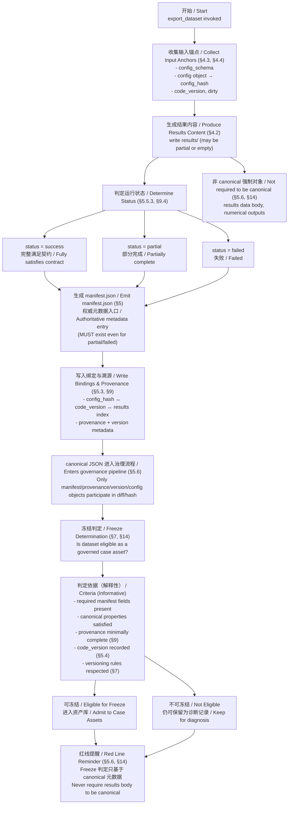

# Dataset Specification

**export_dataset 的权威输出结构与清单规范**

> 本文档定义 `export_dataset` 所生成 数据集 的**权威结构（authoritative structure）\**与 \*\*manifest 规范\*\*。
>  一旦冻结（Freeze），任何结构性变更均视为\**破坏性版本变更（breaking change）**。

---

## 1. 目的与适用范围

本规范用于：

- 定义 `export_dataset` 的**唯一合法输出结构**
- 明确 数据集 在**脱离运行环境**时，仍可被**独立理解、验证与复现**
- 作为下游消费方（分析、复现实验、审计、归档）的**稳定接口契约（Data Contract）**

本规范适用于所有通过 `export_dataset` 生成的 数据集，不依赖具体模型、任务或运行平台。

---

## 2. 设计原则（Design Principles）

1. **权威性（Authoritative）**
    数据集 本身即为最终事实来源，而非某次运行日志的副产物。
2. **自解释性（Self-describing）**
    在不运行任何代码、不访问原始仓库的情况下，数据集 的内容、来源与语义应可被理解。
3. **可追溯性（Provenance-aware）**
    所有结果必须能追溯到：
   - 使用的配置
   - 使用的代码版本
   - 生成时的系统与工具版本
4. **结构冻结（Frozen Structure）**
    数据集 的目录结构与 manifest schema 一经冻结，不得进行隐式或兼容性破坏的修改。
5. **规范表示（Canonical Representation）**
   本规范继承《DESIGN_CONTRACT》中定义的规范表示规则。数据集 的权威元数据入口文件为 `dataset/manifest.json`，其权威格式为 **JSON**；所有参与 **语义差异比较、哈希、溯源 绑定、版本判定与冻结治理**的 数据集 元数据，均以 canonical JSON 表示为准。

---

## 3. Dataset 顶层目录结构（Frozen）

`export_dataset` **必须**生成如下顶层结构：

```
dataset/
├── manifest.json
├── results/
├── config/
├── code/
├── version/
└── README.md   （可选，但强烈建议）
```

### 3.1 顶层结构约束

- 顶层目录名 **必须为** `dataset/`
- 不得在顶层新增未声明的目录
- 所有顶层目录的存在与语义由本规范定义，**不得复用或重载语义**

---

## 4. 各目录语义说明

### 4.1 `manifest.json`（必需）

`manifest.json` 是 数据集 的**权威入口与索引文件**，用于描述：

- 数据集 的身份
- 内容组成
- 溯源 关系
- 版本与冻结信息

详见第 5 章。

------

### 4.2 `results/`（必需）

用于存放 **export_dataset 的核心输出结果**。

约束：

- 内容为只读结果（不可包含生成脚本）
- 结果文件的具体格式由任务定义，但：
  - **文件路径与文件名必须稳定**
  - 所有结果文件 **必须在 manifest 中被引用**

示例：

```
results/
├── predictions.jsonl
├── metrics.json
└── samples/
    └── sample_0001.json
```

------

### 4.3 `config/`（必需）

用于存放**生成 数据集 时使用的全部配置输入**。

约束：

- 必须包含完整、原始、未裁剪的配置
- 配置文件内容必须与生成时完全一致
- 不得仅存 哈希 或摘要

示例：

```
config/
├── run_config.yaml
├── model_config.yaml
└── dataset_config.yaml
```

------

### 4.4 `code/`（必需）

用于存放**生成该 数据集 所依赖的代码快照或其可验证引用信息**。

允许两种形式之一（需在 manifest 中明确）：

1. **代码快照模式**

   ```
   code/
   └── snapshot/
       └── export_pipeline/
   ```

2. **代码引用模式**

   ```
   code/
   └── reference.json
   ```

无论采用哪种方式，必须满足：

- 能唯一确定生成逻辑
- 能支持事后复现或审计

------

### 4.5 `version/`（必需）

用于存放**版本与冻结相关的元信息**。

必须包含：

```
version/
├── dataset_version.txt
└── export_tool_version.txt
```

其中：

- `dataset_version.txt`
   数据集 结构与语义版本（用于破坏性变更判定）
- `export_tool_version.txt`
   执行 `export_dataset` 的工具版本

---

## 5. `manifest.json` 规范（Frozen Schema）

### 5.1 manifest 的角色

`manifest.json` 是：

- 数据集 的**唯一权威描述文件**
- 数据集 内容与 溯源 的**结构化索引**
- 测试与校验的核心对象

------

### 5.2 必含字段（Required Fields）

`manifest.json` **必须**包含以下字段：

```
{
  "dataset_id": "...",
  "created_at": "...",
  "dataset_version": "...",

  "results": {...},
  "config": {...},
  "code": {...},
  "version": {...}
}
```

#### 字段说明

- `dataset_id`
   数据集 的唯一标识符（稳定、可引用）
- `created_at`
   数据集 生成时间（ISO 8601）
- `dataset_version`
   对应 `version/dataset_version.txt`

------

### 5.3 result / config / code / version 的关联方式

#### 5.3.1 `results`

```
"results": {
  "path": "results/",
  "files": [
    "predictions.jsonl",
    "metrics.json"
  ]
}
```

- 明确声明结果所在路径
- 明确声明结果文件清单

------

#### 5.3.2 `config`

```
"config": {
  "path": "config/",
  "files": [
    "run_config.yaml",
    "model_config.yaml"
  ]
}
```

------

#### 5.3.3 `code`

```
"code": {
  "mode": "snapshot",
  "path": "code/snapshot/",
  "commit": "abc123"
}
```

或：

```
"code": {
  "mode": "reference",
  "repository": "...",
  "commit": "...",
  "entrypoint": "export_dataset"
}
```

------

#### 5.3.4 `version`

```
"version": {
  "dataset_version": "1.0.0",
  "export_tool_version": "0.3.2"
}
```

------

### **5.4 代码溯源与治理（Code Provenance & Governance）**

> 本节定义 数据集 的 `manifest.json` 中，**代码相关信息在治理、溯源、语义差异比较、哈希 与冻结判定中的最小规范要求**。

数据集 的 `manifest` **必须包含用于唯一标识生成代码状态的最小代码溯源信息**，并以 **canonical JSON** 表示。

------

#### **5.4.1 强制字段（Minimum Required Fields）**

以下字段 **必须存在**，否则 数据集 被视为 **不具备完整治理能力**：

- **`code_version`**
   用于唯一定位代码状态的不可变标识（例如提交哈希、不可变版本标签或等价引用）。
- **`dirty`**
   布尔值，表示生成 数据集 时工作区是否存在未提交修改；不允许缺省或隐式推断。

------

#### **5.4.2 可选字段（Optional, Strongly Recommended）**

以下字段在 v0.2.x 阶段 **非强制**，但一旦提供，将显著降低未来 case asset 演进与审计成本：

- **`code_hash`**
   对关键代码范围或代码快照内容计算的稳定哈希值。
- **`repository`**
   代码仓库的逻辑标识或访问路径（用于定位代码来源）。
- **`snapshot_path`**
   若采用代码快照模式，指向 数据集 内只读代码副本的路径。

------

#### **5.4.3 规范约束（Normative Constraints）**

- 代码溯源字段 **必须参与 溯源 绑定**，用于回溯、对比与冻结判定；
- ❌ 不得仅通过“文件存在”“路径约定”等隐式方式推断代码状态；
- ❌ 代码本体不属于 canonical JSON 的强制适用对象，其治理**仅通过被 canonical 的 manifest 元数据实现**。

------

## **5.5 Manifest JSON Schema（规范性定义 | Normative）**

> 本节定义 `manifest.json` 的**规范性结构约束**，用于描述字段层级、必选性与语义角色。
>  该 schema 用于规范说明与一致性校验，**不属于运行期数据，不参与 canonical 表示、哈希 计算或冻结判定**。

------

### **5.5.1 顶层结构（Top-level Structure）**

`manifest.json` **必须**是一个 JSON 对象，且至少包含以下顶层字段：

```
manifest
├── manifest_version        (string, required)
├── dataset_id              (string, required)
├── dataset_version         (string, required)
├── status                  (string, required)
├── provenance              (object, required)
├── code                    (object, required)
├── results                 (object, required)
└── metadata                (object, optional)
```

------

### **5.5.2 版本与身份字段**

#### **`manifest_version`**（必选）

- 类型：`string`
- 含义：`manifest.json` 所遵循的 schema 版本
- 用途：用于解析与向前兼容判断
- 约束：版本变更不等同于 数据集 版本变更

#### **`dataset_id`**（必选）

- 类型：`string`
- 含义：数据集 的逻辑标识符
- 约束：在同一资产空间内应保持唯一

#### **`dataset_version`**（必选）

- 类型：`string`
- 含义：数据集 的版本标识
- 用途：参与版本判定与冻结治理

------

### **5.5.3 状态字段**

#### **`status`**（必选）

- 类型：`string`
- 允许值（最小集合）：
  - `success` （成功）
  - `partial` （部分成功）
  - `failed` （失败）
- 含义：描述 数据集 的生成状态
- 约束：
  - `partial` / `failed` 不得被视为异常，必须被完整记录
  - 状态必须与 溯源 中的执行结果一致

------

### **5.5.4 Provenance 结构**

#### **`provenance`**（必选）

- 类型：`object`
- 含义：描述 数据集 的生成因果关系与执行上下文
- 最小结构要求：

```
provenance
├── config_hash     (string, required)
├── run_id          (string, optional)
├── timestamp       (string, optional)
└── notes           (string, optional)
```

- 约束：
  - `config_hash` 必须指向经 canonical JSON 计算的配置对象
  - 溯源 字段必须参与回溯、语义差异比较 与冻结判定

------

### **5.5.5 代码溯源结构（Code）**

#### **`code`**（必选）

- 类型：`object`
- 含义：描述生成 数据集 所依赖的代码状态
- 规范结构：

```
code
├── code_version    (string, required)
├── dirty           (boolean, required)
├── code_hash       (string, optional)
├── repository      (string, optional)
└── snapshot_path   (string, optional)
```

- 约束：
  - `code_version` 必须能够唯一定位代码状态
  - `dirty` 不得省略或隐式推断
  - 代码本体不属于 canonical JSON 的强制适用对象，其治理仅通过该结构实现

------

### **5.5.6 结果索引结构（Results）**

#### **`results`**（必选）

- 类型：`object`
- 含义：对 数据集 中实际结果内容的**结构化索引与描述**
- 要求：
  - 描述结果的组织方式、分片策略或路径
  - 不要求、也不应包含结果内容本体
- 约束：
  - `results` 本身不要求 canonical JSON
  - 治理仅作用于其结构描述，而非数值内容

------

### **5.5.7 可选补充元数据**

#### **`metadata`**（可选）

- 类型：`object`
- 含义：补充性、非治理关键的附加信息
- 示例：
  - 人类可读描述
  - 生成环境摘要
  - 备注信息
- 约束：
  - 不得影响 溯源、版本判定或冻结语义

------

### **5.5.8 规范性约束总结（Normative Summary）**

- `manifest.json` 是 数据集 的**权威元数据入口**
- 其结构必须符合本节定义的规范性 schema
- schema 本身不参与 canonical、哈希 或冻结
- 所有参与治理的字段，其语义必须在 manifest 中明确表达

------

## **5.6 Canonical JSON 的最低规范要求（Frozen）**| 

> 本节定义 **canonical JSON 的最低规范要求**。其目的是确保所有参与**语义差异比较、哈希、溯源绑定、版本判定与冻结治理**的 JSON 对象，在不同实现、不同环境下具有**唯一且一致的语义表示**。

### **5.6.1 适用范围**

本节规范 **仅适用于**以下对象在其作为治理对象时的 JSON 表示：

- `manifest.json`
- `manifest` 中的 provenance、version、config/code 绑定元数据
- 其他被显式声明为 canonical JSON 的治理层元数据

执行期产生的数据内容（如 `results`）**不在本节适用范围内**。

------

### **5.6.2 最低规范要求（Minimum Requirements）**

一个 JSON 对象要被视为 **canonical JSON**，**必须满足以下性质**：

1. **确定性（Determinism）**
    在语义不变的前提下，对同一对象的 canonical JSON 表示必须是确定的，不得依赖运行环境、序列化顺序或实现细节。
2. **语义唯一性（Semantic Uniqueness）**
    不同的 canonical JSON 表示 **不得表达相同语义**；
    语义等价的对象 **必须**映射到相同的 canonical JSON 表示。
3. **结构稳定性（Structural Stability）**
    字段层级、命名与嵌套结构必须稳定，不得通过等价但不同的结构形式表达同一含义。
4. **无冗余性（No Redundant Information）**
    canonical JSON 中不得包含对治理语义无影响的冗余字段、派生字段或重复表达。
5. **显式性（Explicitness）**
    所有影响治理、溯源、版本或冻结判定的语义信息 **必须显式存在于 JSON 中**，不得依赖外部约定、默认值或隐式推断。

------

### **5.6.3 规范性说明（Normative Notes）**

- 本规范 **不规定** canonical JSON 的具体生成算法或序列化实现；
- 不同实现 **可以采用不同方法** 生成 canonical JSON，但其结果 **必须满足上述最低性质**；
- 若上述任一性质不满足，则该 JSON 对象 **不得参与** 语义差异比较、哈希计算、溯源绑定或冻结判定。

---

## 6. 可验证性与测试要求

### 6.1 `test_dataset_manifest`

必须存在自动化测试，覆盖以下内容：

- 顶层目录结构合法性
- `manifest.json` 必含字段校验
- manifest 中声明的路径与文件真实存在
- `dataset_version` 与 `version/` 内容一致

测试失败即视为 数据集 非法。

---

## 7. 冻结与变更规则（Freeze Policy）

### 7.1 冻结判定标准

当满足以下条件时，dataset-spec 视为冻结：

- 数据集 可在**无运行环境**下被理解
- 数据集 的结构与 manifest schema 明确且可验证
- 下游可以仅依赖本规范消费 数据集

---

### 7.2 变更规则

以下任一变更 **必须提升 dataset_version 的主版本号（Major）**：

- 顶层目录结构变化
- manifest 必含字段变化
- 字段语义变化
- 溯源 关联方式变化

任何未升级版本号的结构性变更，均视为 **违反 Data Contract**。

**版本红线（C 梁）：凡涉及数据集输出结构、manifest 语义、溯源绑定或 canonical 治理规则的任何破坏性变更，必须提升 `dataset_version` 的主版本号（Major）**

---

## 8. 地位声明

本规范是：

- `export_dataset` 的**权威输出合同**
- 下游系统的**唯一结构假设来源**
- 数据集 生命周期中不可被隐式修改的基石

---
## 9. 溯源最小保障规范（Minimal Provenance Guarantees）

> 本章节定义 数据集 在当前阶段（v0.2.x）必须满足的**最小 溯源 保障**，以确保其在未来可以**无歧义演进为完整 case asset**（如可审计研究案例、复现实验包或治理对象）。

------

### 9.1 Provenance 的定义边界

在本规范中，**溯源** 指 数据集 在生成时所需的**最低限度因果与来源信息**，用于回答以下问题：

- 这个 数据集 是**由什么生成的**
- **在什么条件下**生成
- 是否**完整、成功、可被信任**
- 在失败或中断时，发生了什么

溯源 **不等同于完整日志系统**，但必须足以支撑后续扩展。

------

### 9.2 Provenance 最小字段集合（Frozen – Minimal Set）

以下字段构成 **数据集 的最小 溯源 集合**，必须能在 **manifest.json + version/** 中被完整表达。

#### 9.2.1 强制字段（Mandatory）

以下字段 **必须存在**，否则 数据集 被视为 **不合规**：

##### A. 生成身份（Generation Identity）

```
"provenance": {
  "generator": {
    "tool": "export_dataset",
    "tool_version": "0.3.2"
  }
}
```

- 明确是由哪个工具生成
- 明确工具版本（即使是本地开发版）

------

##### B. 时间与状态（Time & Status）

```
"provenance": {
  "created_at": "2026-01-27T10:32:11Z",
  "status": "success"
}
```

其中 `status` 取值限定为：

- `success`：完整成功生成
- `partial`：部分生成（见 9.4）
- `failed`：失败但留下记录

------

##### C. 输入关联（Input Binding）

```
"provenance": {
  "inputs": {
    "config_path": "config/",
    "code_ref": "code/"
  }
}
```

含义：

- 数据集 **必须显式绑定**其输入配置与代码来源
- 不允许“结果孤立存在”

------

#### 9.2.2 可选字段（Optional, Strongly Recommended）

以下字段 **不是 v0.2 的硬性要求**，但一旦存在，将显著降低未来 case asset 演进成本。

##### D. 执行环境摘要

```
"environment": {
  "os": "linux",
  "python": "3.10",
  "hardware": "A100"
}
```

> 注：这是摘要，不是完整依赖锁文件。

------

##### E. 上游数据引用（Upstream Reference）

```
"upstream": {
  "source_dataset_id": "...",
  "source_version": "..."
}
```

用于 数据集 链式演进。

------

### 9.3 Provenance 在 manifest.json 中的位置（ENHANCE）

`manifest.json` **必须允许**（即 schema 预留）如下结构：

```
{
  "dataset_id": "...",
  "dataset_version": "...",

  "provenance": {
    "generator": {...},
    "created_at": "...",
    "status": "...",
    "inputs": {...}
  },

  "results": {...},
  "config": {...},
  "code": {...},
  "version": {...}
}
```

- `provenance` 为 **一级字段**
- 不得隐藏在 `meta` 或非标准命名中

------

### 9.4 失败 / 不完整运行的记录策略（NEW）

#### 9.4.1 设计目标

即使 `export_dataset`：

- 中途失败
- 只生成部分结果
- 或被人为中断

**也必须产出一个最小合法 数据集**，用于：

- 调试
- 治理审计
- 后续补跑或对比

------

#### 9.4.2 `status = partial | failed` 的最小要求

当 `status ≠ success` 时：

##### 必须满足：

- `manifest.json` 存在
- `provenance.status` 明确
- `config/` 与 `code/` 仍然完整
- `results/` 可以为空，但必须存在目录

##### 推荐增加：

```
"provenance": {
  "failure_reason": "OOM during evaluation",
  "last_completed_step": "metrics_computation"
}
```

------

#### 9.4.3 禁止行为

- ❌ 失败时静默不输出 数据集
- ❌ 仅输出日志而无结构化记录
- ❌ 让下游无法区分“空结果”和“失败结果”

---

## 10. Manifest 字段表（Manifest Field Table）

> **Issue C1 版本中未显式表格化，此处补充冻结视图**

| 字段路径              | 必需 | 说明                   |
| --------------------- | ---- | ---------------------- |
| dataset_id            | 是   | 数据集 唯一标识        |
| dataset_version       | 是   | 结构与语义版本         |
| provenance.generator  | 是   | 生成工具与版本         |
| provenance.created_at | 是   | 生成时间               |
| provenance.status     | 是   | 成功 / 部分成功 / 失败 |
| results               | 是   | 结果索引               |
| config                | 是   | 输入配置               |
| code                  | 是   | 代码绑定               |
| version               | 是   | 版本声明               |

---

## 11. 样本组织规范（Sample Organization）

> **此前仅示例，未规范化，此处增强**

若 数据集 包含样本级数据，推荐：

```
results/
└── samples/
    ├── sample_0001.json
    ├── sample_0002.json
    └── index.json
```

约束：

- 样本文件 **必须可独立解析**
- `index.json`（如存在）仅作索引，不得承载权威语义

------

## 12. 压缩与分片策略（Compression & Sharding）

### 12.1 压缩

- 允许对 `results/` 使用 `.gz` / `.zst`
- manifest **必须显式声明压缩格式**
- 不允许隐式压缩

```
"results": {
  "compression": "gzip"
}
```

------

### 12.2 分片（Sharding）

当结果规模较大时：

```
results/
├── shard_000.jsonl
├── shard_001.jsonl
└── shards.json
```

要求：

- shard 数量与顺序在 manifest 中声明
- 不得依赖文件系统顺序作为语义

---

## 13. 与主流 AI 框架的读取建议（Non-normative）

> 本节为**建议性（Non-normative）**，不构成冻结约束。

### 13.1 PyTorch

- 推荐以 `results/` 为 Dataset 输入
- 使用 `manifest.json` 作为 metadata

### 13.2 TensorFlow / MindSpore

- 推荐在导入前解析 manifest
- 显式处理 `status ≠ success` 的情况

------

## 14. 冻结声明补充（Freeze Scope Clarification）

以下内容 **纳入冻结范围**：

- provenance 最小字段集合
- provenance.status 语义
- 失败 / 部分完成 数据集 的存在性要求

以下内容 **不纳入冻结范围**：

- 环境 具体字段
- 上游数据链路深度

---

## 附录 | Appendix

建议读者在首次阅读本规范时，**先通读本附录中的对象层级图（Appendix A）与生命周期图（Appendix B）**，以快速建立 C 梁数据集对象、治理边界与冻结判定的整体心智模型；随后再回到正文，重点对照 **§5（Manifest）、§5.6（Canonical JSON）、§9（Provenance）与 §14（Red Lines）** 阅读具体规范条款。

### Appendix A. C 梁 对象层级图（解释性视图）

> **说明 / Note**
>  本附录为解释性视图（Informative），用于帮助读者理解 C 梁（`export_dataset`）输出资产的对象层级、治理边界与 canonical 适用范围。
>  本附录**不引入新的规范约束**；所有规范性要求以正文条款（尤其是 §3、§5、§5.6、§9、§14）为准。

```mermaid
flowchart TB
  %% ========= Top-level =========
  DS["dataset/ 数据集根目录 / Dataset Root Directory (§3)"]
  SPEC["dataset-spec.md 输出契约 / Output Contract"]
  DS --> SPEC

  %% ========= Authoritative entry =========
  MAN["manifest.json 权威元数据入口 / Authoritative Metadata Entry (§5)"]
  DS --> MAN

  %% ========= Governance-layer metadata inside manifest =========
  subgraph GOV["治理层元数据 / Governance-layer Metadata (canonical JSON) (§5.6)"]
    ID["身份与版本 / Identity & Version\n(dataset_id, dataset_version, manifest_version, status) (§5.2, §5.5)"]
    PROV["溯源 / Provenance\n(config_hash, generator, status, timestamp, ...) (§9)"]
    BIND["绑定关系 / Bindings\nconfig ↔ code ↔ results ↔ version (§5.3)"]
    CODEMETA["代码元数据 / Code Metadata\n(code_version, dirty, ...) (§5.4)"]
    RESIDX["结果索引 / Results Index\n(paths, shards, formats) (§5.3, §5.5.6)"]
  end

  MAN --> GOV
  GOV --> ID
  GOV --> PROV
  GOV --> BIND
  GOV --> CODEMETA
  GOV --> RESIDX

  %% ========= Non-canonical data body =========
  subgraph BODY["数据内容本体 / Data Body (NOT canonical requirement)"]
    RES["results/ 结果内容 / Results Content (§4.2)"]
    ART["artifacts/ 附属产物 / Auxiliary Artifacts (optional)"]
  end

  DS --> RES
  DS --> ART

  %% ========= Inputs referenced by manifest =========
  subgraph INPUTS["输入锚点（通过元数据引用） / Input Anchors (referenced by metadata)"]
    CFG["config 对象 / Config Object\n(canonical JSON for governance) (§4.3, §5.6)"]
    SCHEMA["config_schema 输入契约 / Input Contract"]
    CODE["code 身份 / Code Identity\n(via code_version, reference or snapshot) (§4.4, §5.4)"]
  end

  PROV --> CFG
  CFG --> SCHEMA
  CODEMETA --> CODE

  %% ========= Notes on canonical boundary =========
  NOTE1["红线 / Canonical Red Line (§5.6, §14):\nresults 内容本体不要求/不应被当作 canonical JSON\nResults body MUST NOT be required or assumed canonical"]
  RES --> NOTE1
```



------

### Appendix B. C 梁 生命周期和冻结边界（解释性视图）

> **说明 / Note**
>  本附录为解释性视图（Informative），描述 C 梁数据集从生成到冻结判定的典型生命周期，以及 canonical JSON、溯源 与版本在其中的作用位置。
>  本附录**不引入新的规范约束**；冻结与治理语义以 §5.6、§7、§9、§14 为准。


